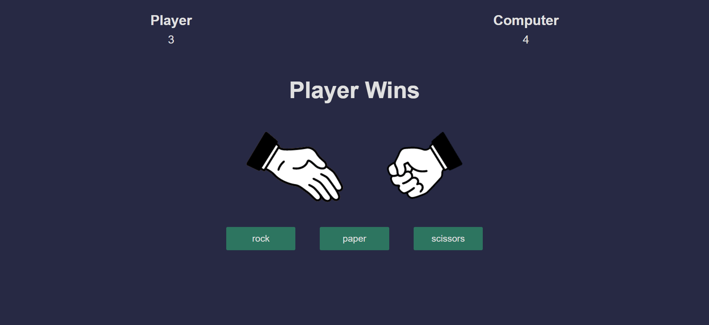

# Rock Paper Scissor with JS
The Paper Rock Scissor game is a classic game that has been enjoyed by generations. In this game, two players choose one of three options: paper, rock, or scissors. Each option beats another in a circular fashion: paper beats rock, rock beats scissors, and scissors beat paper.

The game has a basic user interface that allows the user to choose their option and displays the computer choice. The choice of computer is random each time.

